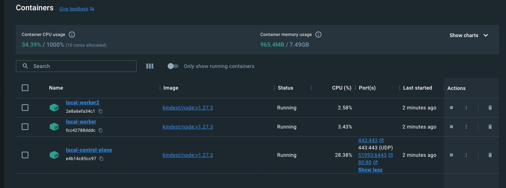

# Cluster
## Create kind config
### cluster.yaml
```yaml
kind: Cluster
apiVersion: kind.x-k8s.io/v1alpha4
name: local
nodes:
- role: control-plane
  kubeadmConfigPatches:
  - |
    kind: InitConfiguration
    nodeRegistration:
      kubeletExtraArgs:
        node-labels: "ingress-ready=true"
  extraPortMappings:
  - containerPort: 80
    hostPort: 80
    protocol: TCP
  - containerPort: 443
    hostPort: 443
    protocol: TCP
  - containerPort: 443
    hostPort: 443
    protocol: UDP
- role: worker
- role: worker
```
### Create cluster
```terminal
kind create cluster --config cluster.yaml
```
### Output
```
~/projects/tutorials/kind-k8s-local/docs/resources  kind create cluster --config cluster.yaml
Creating cluster "local" ...
 ✓ Ensuring node image (kindest/node:v1.27.3) 🖼 
 ✓ Preparing nodes 📦 📦 📦  
 ✓ Writing configuration 📜 
 ✓ Starting control-plane 🕹️ 
 ✓ Installing CNI 🔌 
 ✓ Installing StorageClass 💾 
 ✓ Joining worker nodes 🚜 
Set kubectl context to "kind-local"
You can now use your cluster with:

kubectl cluster-info --context kind-local

Not sure what to do next? 😅  Check out https://kind.sigs.k8s.io/docs/user/quick-start/
```
