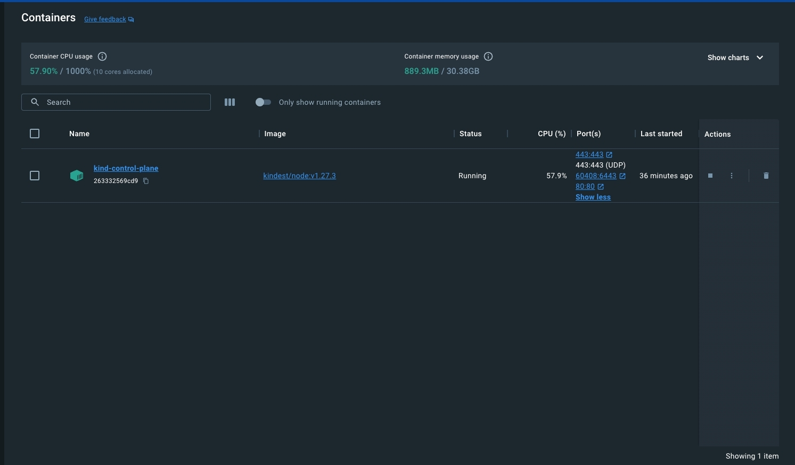

# Cluster
## Create kind config
### cluster.yaml
```yaml
kind: Cluster
apiVersion: kind.x-k8s.io/v1alpha4
nodes:
- role: control-plane
  kubeadmConfigPatches:
  - |
    kind: InitConfiguration
    nodeRegistration:
      kubeletExtraArgs:
        node-labels: "ingress-ready=true"    
  extraPortMappings:
  - containerPort: 80
    hostPort: 80
    listenAddress: 127.0.0.1
    protocol: TCP
  - containerPort: 443
    hostPort: 443
    listenAddress: 127.0.0.1
    protocol: TCP
  - containerPort: 443
    hostPort: 443
    listenAddress: 127.0.0.1
    protocol: UDP
```
### Create cluster
```terminal
kind create cluster --config cluster.yaml
```
### Output
```
Creating cluster "kind" ...
 ✓ Ensuring node image (kindest/node:v1.27.3) 🖼 
 ✓ Preparing nodes 📦  
 ✓ Writing configuration 📜 
 ✓ Starting control-plane 🕹️ 
 ✓ Installing CNI 🔌 
 ✓ Installing StorageClass 💾 
Set kubectl context to "kind-kind"
You can now use your cluster with:

kubectl cluster-info --context kind-kind

Have a nice day! 👋
```

### Get nodes
```
kubectl get nodes -o wide
NAME                 STATUS   ROLES           AGE   VERSION   INTERNAL-IP   EXTERNAL-IP   OS-IMAGE                         KERNEL-VERSION        CONTAINER-RUNTIME
kind-control-plane   Ready    control-plane   26s   v1.27.3   172.18.0.2    <none>        Debian GNU/Linux 11 (bullseye)   5.15.49-linuxkit-pr   containerd://1.7.1
```