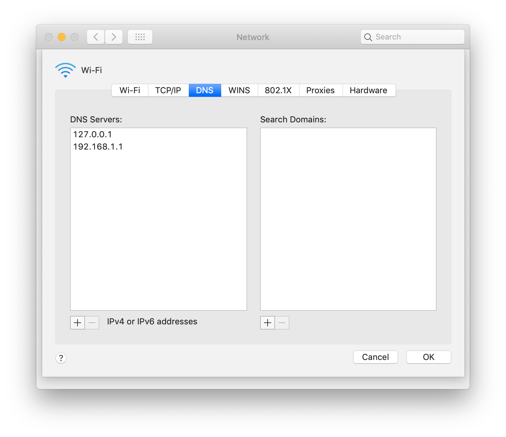

# DNS
```
brew install dnsmasq
```
### add dnsmasq.conf
```
sudo vi /usr/local/etc/dnsmasq.conf
```
```
address=/kind.local/127.0.0.1
server=8.8.8.8
server=8.8.4.4
```
### restart service
```
sudo brew services restart dnsmasq
```
### create resolver
```
sudo mkdir /etc/resolver/
cat <<EOF | sudo tee /etc/resolver/kind.local
domain kind.local
search kind.local
nameserver 127.0.0.1
EOF
```
### Restart mDNSResponder
```
sudo killall -HUP mDNSResponder
```
```
scutil --dns
```


### test dns
```
dig flutter.kind.local
```